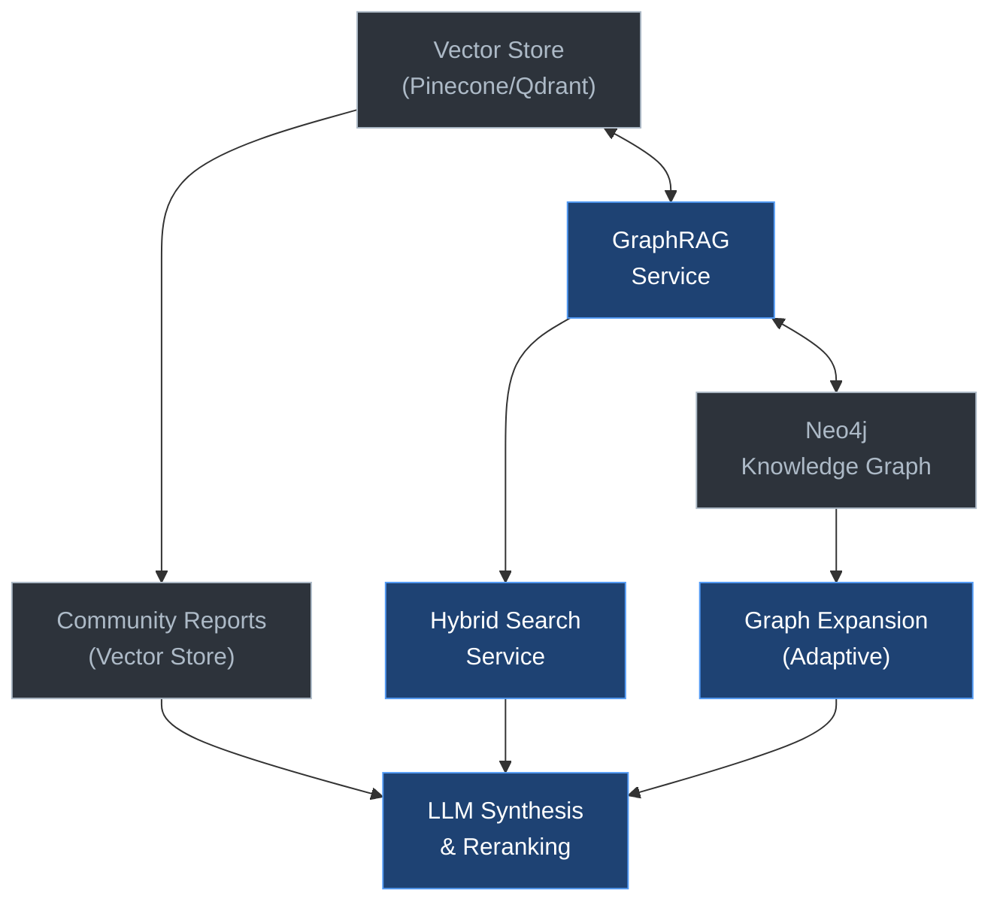

# REPORT - Knowledge Graph (GraphRAG) Module

## 1. Introduction

The **Knowledge Graph** module of Tiledesk LLM implements a **GraphRAG** (Graph-based Retrieval Augmented Generation) architecture that combines:
- **Knowledge Graph** (Neo4j) to store entities and relationships extracted from documents
- **Vector Store** (Pinecone/Qdrant) for semantic search on chunks and reports
- **MinIO** for storing Parquet reports
- **LLM** for entity extraction, report generation, and answer synthesis

The system offers three main query modes:
1. **Global Search** (`/api/kg/qa`): search only on community reports
2. **Integrated Hybrid Search** (`/api/kg/hybrid`): complete pipeline combining global search, local search, and graph expansion
3. **Graph creation** (`/api/kg/create`): document import, GraphRAG extraction, clustering, and report generation

This document describes in detail the operation of each component and the end-to-end data flow.

## 2. Module Architecture



**Main components:**
- **`CommunityGraphService`** (`services/community_graph_service.py`): orchestrator for report creation and global/hybrid searches
- **`GraphRAGService`** (`services/services.py`): extraction of entities and relationships from chunks, import to Neo4j
- **`ClusterService`** (`services/clustering.py`): Louvain/Leiden clustering for community detection
- **`GraphExpander`** (`utils/graph_expansion.py`): adaptive graph expansion from seed nodes
- **`TileReranker`** (`tilellm/tools/reranker.py`): cross‑encoder for result reranking
- **`GraphRepository`** (`repository/repository.py`): CRUD abstraction for Neo4j

## 3. Knowledge Graph Creation (`/api/kg/create`)

**Endpoint:** `POST /api/kg/create`  
**Purpose:** import chunks from a vector store namespace, extract entities and relationships, save them to Neo4j, generate community reports, and index them for semantic search.

### 3.1 Detailed Flow

```
1. Retrieve chunks from vector store
   ↓
2. GraphRAG extraction (entities + relationships) for each chunk
   ↓
3. Import to Neo4j (nodes + edges)
   ↓
4. Hierarchical clustering (Leiden, 3 levels)
   ↓
5. Community report generation (LLM)
   ↓
6. Enrichment with synthetic questions (LLM)
   ↓
7. Report indexing in vector store (embedding)
   ↓
8. Parquet export + MinIO upload (optional)
```

#### **1. Chunk retrieval** (`community_graph_service.py:144`)
The service queries the vector store (configured via `engine`) in the specified `namespace`, with an optional chunk limit (`limit`).

#### **2. GraphRAG extraction** (`services/services.py`)
For each chunk, an LLM is invoked with a specialized prompt to identify:
- **Entities** (e.g., `PERSON`, `ORGANIZATION`, `LOCATION`) with properties (name, description, type)
- **Relationships** (e.g., `WORKED_FOR`, `LOCATED_IN`, `PART_OF`) between identified entities

Entities are deduplicated: if an entity with the same name and type already exists, it is reused.

#### **3. Import to Neo4j** (`repository/repository.py`)
- Each entity becomes a **node** with a label corresponding to its type and properties `name`, `description`, `namespace`, `index_name`, `source_id` (reference to the source chunk)
- Each relationship becomes an **edge** between nodes, with type and properties (e.g., `weight`, `context`)

#### **4. Hierarchical clustering** (`services/clustering.py`)
The `ClusterService` applies the **Leiden** algorithm with three resolution levels:
- **Level 0** (resolution 1.2): large communities, general overview
- **Level 1** (resolution 0.8): medium communities
- **Level 2** (resolution 0.5): small, highly specific communities

Each community is identified by a unique `community_id`.

#### **5. Community report generation** (`services/clustering.py`)
For each community, an LLM generates a structured report with:
- **Title**: summary of the community topic
- **Summary**: overview of contents
- **Rating** (0-5): assessment of cohesion and relevance
- **Full report**: detailed description with list of main entities

#### **6. Enrichment with synthetic questions** (`utils/synthetic_qa.py`)
Each report is enriched with **3 synthetic questions** generated by the same LLM, improving semantic retrievability (e.g., "What does organization X do?").

#### **7. Report indexing in vector store** (`community_graph_service.py:313`)
Reports (full content + synthetic questions) are converted into LangChain `Document` objects and inserted into a dedicated namespace (`{namespace}-reports`) of the same vector store, using the provided embeddings (`llm_embeddings`). This enables subsequent semantic search on reports.

#### **8. Parquet export + MinIO** (`community_graph_service.py:330`)
Reports, entities, and relationships are written to Parquet files and, if configured, uploaded to MinIO for batch analysis or offline reuse.

### 3.2 Role of LLMs
- **Entity/relationship extraction**: GraphRAG prompt to identify entities and connections
- **Report generation**: synthesis of the community in natural language
- **Synthetic questions**: creation of example queries to improve search

### 3.3 Role of embeddings
- Original chunks are already embedded in the vector store
- Reports are also embedded (with the same model) to enable semantic search

**Source file references:**
- `tilellm/modules/knowledge_graph/controllers.py:213` – endpoint `/create`
- `tilellm/modules/knowledge_graph/logic.py:216` – logic `create_graph`
- `tilellm/modules/knowledge_graph/services/community_graph_service.py:144` – `create_community_graph`
- `tilellm/modules/knowledge_graph/services/clustering.py` – clustering and report generation
- `tilellm/modules/knowledge_graph/utils/synthetic_qa.py` – synthetic questions

## 4. Querying: Global Search (`/api/kg/qa`)

**Endpoint:** `POST /api/kg/qa`  
**Purpose:** answer a question by searching **only** in community reports, without accessing original chunks. Ideal for high‑level questions requiring an overview.

### 4.1 Detailed Flow

```
1. Hybrid semantic search on reports
   ↓
2. RRF (Reciprocal Rank Fusion) [optional]
   ↓
3. Cross‑encoder reranking
   ↓
4. Map‑Reduce with LLM:
   - MAP: single‑report analysis
   - REDUCE: final synthesis
   ↓
5. Chat history update
```

#### **1. Hybrid semantic search** (`community_graph_service.py:864`)
- The question is converted into a **dense embedding** via `llm_embeddings`
- If configured, a **sparse vector** (SPLADE encoder) is also generated for keyword search
- A hybrid search (dense + sparse) is executed in the `{namespace}-reports` namespace of the vector store

#### **2. RRF (Reciprocal Rank Fusion)** (`utils/rrf.py`)
Results from the two searches (dense and sparse) are fused via **Reciprocal Rank Fusion**, balancing recall and precision to produce a robust ranked list.

#### **3. Cross‑encoder reranking** (`community_graph_service.py:884`)
Resulting documents are **reranked** by a cross‑encoder (`TileReranker`) that directly evaluates query‑document relevance, selecting the top‑k most relevant.

#### **4. Map‑Reduce with LLM** (`community_graph_service.py:950`)
- **MAP**: each selected report is analyzed by an LLM with a prompt asking to extract information relevant to the question (in the user's original language). Irrelevant reports return `NOT_RELEVANT`.
- **REDUCE**: partial answers are combined by another LLM invocation that synthesizes a final answer, taking conversation history into account.

#### **5. Chat history update** (`community_graph_service.py:1032`)
The question and answer are added to the `chat_history_dict` dictionary to maintain dialog context.

### 4.2 Role of LLMs
- **MAP phase**: targeted extraction from individual reports
- **REDUCE phase**: cohesive, multilingual synthesis

### 4.3 Role of embeddings and reranking
- Dense and sparse embeddings for hybrid retrieval
- Cross‑encoder for reranking, dramatically improving precision

**Source file references:**
- `tilellm/modules/knowledge_graph/controllers.py:327` – endpoint `/qa`
- `tilellm/modules/knowledge_graph/logic.py:358` – logic `query_graph`
- `tilellm/modules/knowledge_graph/services/community_graph_service.py:864` – `query_with_global_search`
- `tilellm/modules/knowledge_graph/utils/rrf.py` – RRF implementation

## 5. Querying: Integrated Hybrid Search (`/api/kg/hybrid`)

**Endpoint:** `POST /api/kg/hybrid`  
**Purpose:** execute a complete pipeline that combines **global search** (on reports), **local search** (on original chunks), and **graph expansion** (adaptive expansion from the knowledge graph), followed by reranking and LLM synthesis. This is the "heart" of the GraphRAG system.

### 5.1 Detailed Flow

```
1. Query analysis (type detection)
   ↓
2. Parallel retrieval:
   - Task A: Global search (reports)
   - Task B: Local search (chunks)
   ↓
3. Graph expansion (adaptive multi‑hop)
   ↓
4. Final reranking (cross‑encoder)
   ↓
5. LLM synthesis with unified context
   ↓
6. Chat history update
```

#### **1. Query analysis** (`services/services.py`)
The `GraphRAGService` classifies the question into one of three types:
- **Technical**: requires precision, little expansion (e.g., "What is the formula for...")
- **Exploratory**: requires exploration, medium expansion (e.g., "Tell me about...")
- **Relational**: requires depth of relationships, maximum expansion (e.g., "What are the connections between X and Y?")

Weights between vector, keyword, and graph search are adjusted accordingly.

#### **2. Parallel retrieval** (`community_graph_service.py:1286`)
Two searches are launched **in parallel**:

- **Task A: Global search**  
  Same as `/api/kg/qa`, but limited to top‑5 reports.

- **Task B: Local search**  
  Hybrid search (dense + keyword) on the original chunk namespace, with alpha determined by weights. Results are fused with RRF.

#### **3. Graph expansion (adaptive multi‑hop)** (`utils/graph_expansion.py:39`)
From the most relevant local chunks, **seed node** IDs linked to them are extracted. The `GraphExpander` service performs **adaptive** expansion:

- **Dynamic hop count**:  
  `technical=1`, `exploratory=2`, `relational=3` (configurable in `HOP_CONFIG`)

- **Early stopping**:  
  If a hop produces few new nodes (< `MIN_NEW_NODES_PER_HOP`) or the absolute node limit (`MAX_NODES_ABSOLUTE`) is reached, expansion stops.

- **Optimized Cypher query**:  
  Retrieves nodes and relationships filtering by `namespace`/`index_name` and ordering by relationship weight.

Expansion transforms isolated fragments into a **coherent narrative**, capturing connections between entities.

#### **4. Final reranking** (`community_graph_service.py:1480`)
All contexts (global reports, local chunks, graph entities) are merged into a list of LangChain `Document` objects and **reranked** by a cross‑encoder, selecting the 20 most relevant.

#### **5. LLM synthesis** (`community_graph_service.py:1496`)
The final context is passed to an LLM together with conversation history, with instructions to produce an answer in the user's language, integrating the different sources (reports, documents, graph).

#### **6. Chat history update** (`community_graph_service.py:1535`)
The question and answer are added to the history to maintain context.

### 5.2 Role of LLMs
- **Query type classification**
- **Final context synthesis** (integration of the three sources)
- (Optional) synthetic question generation during report creation

### 5.3 Role of embeddings
- **Dense embeddings** for vector search
- **Sparse embeddings** (SPLADE) for keyword search
- **Report embeddings** for global search

### 5.4 Role of reranking
- **Cross‑encoder** (e.g., `TileReranker`) improves result ordering before LLM synthesis.

### 5.5 Role of the knowledge graph (Neo4j)
- Stores extracted entities and relationships
- Provides the **adaptive graph expansion** mechanism to retrieve relevant connections from seeds

**Source file references:**
- `tilellm/modules/knowledge_graph/controllers.py:344` – endpoint `/hybrid`
- `tilellm/modules/knowledge_graph/logic.py:407` – logic `context_fusion_graph_search`
- `tilellm/modules/knowledge_graph/services/community_graph_service.py:1206` – `context_fusion_search`
- `tilellm/modules/knowledge_graph/utils/graph_expansion.py:39` – `expand_from_seeds` (adaptive expansion)

## 6. Key Components

### 6.1 Adaptive Graph Expansion (`utils/graph_expansion.py`)
**Definition:** multi‑hop expansion that adapts the number of hops based on query type.

**Hop configuration:**
```python
HOP_CONFIG = {
    'technical': 1,      # Precise queries → 1 hop (focused context)
    'exploratory': 2,    # Exploratory queries → 2 hops (broad context)
    'relational': 3      # Relational queries → 3 hops (connection depth)
}
```

**Early stopping:**
- If a hop produces fewer than `MIN_NEW_NODES_PER_HOP` (default: 3) new nodes, expansion stops
- Absolute limit: `MAX_NODES_ABSOLUTE` (default: 200) total nodes

**Optimized Cypher query:** filters by namespace, index_name and orders by relationship weight.

### 6.2 Reciprocal Rank Fusion (RRF) (`utils/rrf.py`)
**Purpose:** fuse the ranked lists from dense and sparse search into a single robust list.

**Formula:** `score = 1 / (k + rank)` for each result, summing scores across lists.

**Advantages:** balances recall (sparse) and precision (dense), improving overall retrieval quality.

### 6.3 Synthetic QA Enrichment (`utils/synthetic_qa.py`)
**Purpose:** enrich community reports with synthetic questions generated by an LLM.

**Flow:**
1. For each report, the LLM generates 3 example questions
2. Questions are included in the report metadata
3. During indexing, the report content + questions are embedded

**Effect:** improves semantic retrievability, especially for queries phrased differently from the report content.

### 6.4 Query Type Detection (`utils/query_analysis.py`)
**Purpose:** classify the query to adjust search weights and expansion strategy.

**Methods:**
- **LLM‑based:** prompt to LLM for classification
- **Heuristic fallback:** lexical analysis (technical keywords, interrogatives, etc.)

**Adjusted weights:**
- **Technical:** more weight to vector search, less to graph
- **Exploratory:** balanced between vector, keyword, and graph
- **Relational:** more weight to graph, deep expansion

## 7. Flow Diagrams

### 7.1 Knowledge Graph Creation
```
[Vector Store]
    ↓ (retrieve chunks)
[GraphRAG Service]
    ↓ (extract entities/relationships)
[Neo4j Import]
    ↓ (save nodes+edges)
[Cluster Service]
    ↓ (Leiden clustering)
[LLM Report Generation]
    ↓ (generate reports)
[Synthetic QA]
    ↓ (add questions)
[Vector Store Indexing]
    ↓ (embedding reports)
[Parquet Export]
    ↓ (upload MinIO)
```

### 7.2 Integrated Hybrid Search
```
[User Question]
    ↓
[Query Type Detection] → (technical/exploratory/relational)
    ↓
[Parallel Retrieval]
├─ Global Search (reports) → [RRF] → [Reranking]
└─ Local Search (chunks) → [RRF] → [Reranking]
    ↓
[Graph Expansion] → (adaptive multi‑hop)
    ↓
[Context Fusion] → (merge reports+chunks+graph)
    ↓
[Cross‑Encoder Reranking] → (top‑20 relevant)
    ↓
[LLM Synthesis] → (final answer)
    ↓
[Update Chat History]
```

## 8. Usage Examples

### 8.1 Graph creation
```bash
curl -X POST http://localhost:8000/api/kg/create \
  -H "Content-Type: application/json" \
  -d '{
    "namespace": "bancaitalia",
    "engine": {
      "name": "pinecone",
      "type": "serverless",
      "apikey": "***",
      "index_name": "tilellm"
    },
    "limit": 1000,
    "overwrite": true,
    "llm_key": "openai",
    "model": "gpt-4"
  }'
```

### 8.2 Hybrid Search
```bash
curl -X POST http://localhost:8000/api/kg/hybrid \
  -H "Content-Type: application/json" \
  -d '{
    "question": "What are the relationships between Mario Draghi and the ECB?",
    "namespace": "bancaitalia",
    "engine": {
      "name": "pinecone",
      "type": "serverless",
      "apikey": "***",
      "index_name": "tilellm"
    },
    "search_type": "hybrid",
    "use_reranking": true,
    "llm_key": "openai",
    "model": "gpt-4"
  }'
```

## 9. Source File References

| Component | File | Relevant Lines |
|-----------|------|----------------|
| **Endpoint `/create`** | `controllers.py` | 213-224 |
| **Logic `create_graph`** | `logic.py` | 216-254 |
| **`create_community_graph`** | `community_graph_service.py` | 144-245 |
| **Clustering & reports** | `clustering.py` | various |
| **Synthetic QA** | `synthetic_qa.py` | all |
| **Endpoint `/qa`** | `controllers.py` | 327-341 |
| **`query_with_global_search`** | `community_graph_service.py` | 864-1048 |
| **RRF** | `rrf.py` | all |
| **Endpoint `/hybrid`** | `controllers.py` | 344-369 |
| **`context_fusion_search`** | `community_graph_service.py` | 1206-1561 |
| **`GraphExpander`** | `graph_expansion.py` | 39-208 |
| **Query analysis** | `query_analysis.py` | all |

## 10. Conclusions

The **Knowledge Graph** module of Tiledesk LLM implements a complete, modular GraphRAG architecture that:
1. **Automatically builds** a knowledge graph from existing documents in the vector store
2. **Generates hierarchical community reports** enriched with synthetic questions
3. **Offers three progressive query modes** (global, hybrid, full expansion)
4. **Dynamically adapts** retrieval strategy based on query type
5. **Integrates multiple IR techniques**: dense/sparse embeddings, RRF, cross‑encoder reranking, adaptive graph expansion

The system is designed to be extensible with new clustering algorithms, expansion strategies, and reranking models, while maintaining integration with the Tiledesk LLM ecosystem (Pinecone, Qdrant, OpenAI, Azure, etc.).

---

*Document updated: January 02, 2026*  
*Module: `tilellm/modules/knowledge_graph`*